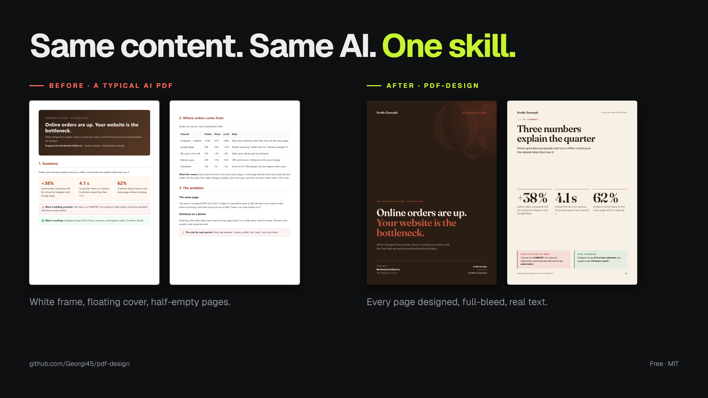

# pdf-design

**Your AI makes PDFs that look like printed websites. This skill fixes it.**



Ask Claude — or any AI agent — for "a nice PDF report" and you usually get a web page sent to the printer: a white frame around every page, a dark cover floating in the middle of an A4, pages that stop halfway. **pdf-design** teaches your agent to lay out documents the way a designer does, one sheet at a time, and to check its own work before handing the PDF over.

*Leer en español: [README.es.md](README.es.md)*

- **Every page designed as a whole.** Full-bleed backgrounds, covers, dividers and closing pages. A4, A4 landscape or 16:9.
- **Real text.** Vector and selectable, fonts embedded. No screenshots glued into a PDF.
- **It reviews itself.** A print script measures every page — content cut off, text over the footer, half-empty pages, missing fonts — and renders a PNG of each sheet for the agent to look at before delivering.
- **Themes.** Six built in: `poster`, `gallery`, `ledger`, `archive`, `product` and `stage` — and each one is a whole design, not a palette: its own margins, type scale, corners, rules and ornament. Already have a brand? Point `brand.mjs` at your `DESIGN.md`, your design tokens, a CSS file or your live site and it writes the theme for you.
- **Nothing to build.** No npm install. Node 22+ and the Chrome you already have.

## See it

- [A4 client report, `product` theme (PDF)](examples/report-a4.pdf) · [source](examples/report-a4.html)
- [16:9 proposal deck, `stage` theme (PDF)](examples/deck-16-9.pdf) · [source](examples/deck-16-9.html)
- [The same three pages in all six themes](examples/themes/) · [source](examples/themes/showcase.html)
- [The "before": the same report, printed the usual way (PDF)](examples/before/report-web-style.pdf)

## Install

| Where | How |
|---|---|
| Any agent (Claude Code, Codex, Cursor, Gemini CLI, Copilot…) | `npx skills add Georgi45/pdf-design` |
| Claude Code, as a plugin | `/plugin marketplace add https://github.com/Georgi45/pdf-design` then `/plugin install pdf-design@pdf-design` |
| claude.ai (experimental) | Download `pdf-design.zip` from [Releases](https://github.com/Georgi45/pdf-design/releases) → Customize → Skills → Upload. Code execution must be on. |
| By hand | Copy `skills/pdf-design/` into your agent's skills folder, for example `~/.claude/skills/`. |

Or paste this into your agent: *"Install the skill from github.com/Georgi45/pdf-design"*.

**Requirements:** Node.js 22+ and Chrome, Chromium or Edge (or set `CHROME_PATH`).

## Use it

Just ask for the document:

> Make a PDF report of our Q3 numbers for the client. A4, product theme.

> Turn this proposal into a 16:9 PDF deck.

The agent then:
1. Shows you a **sheet plan**: one idea and one headline per page.
2. Builds each sheet in HTML with the skill's layouts.
3. Prints it with `scripts/print.mjs`.
4. Looks at every page and fixes whatever the check flags.
5. Hands you the PDF.

You can also print by hand:

```
node skills/pdf-design/scripts/print.mjs my-report.html
```

```
PDF:     my-report.pdf  (6 pages, 467 KB, 210 × 297 mm, theme: product)
Fonts:   Fraunces-72pt-SemiBold, Instrument-Sans, Instrument-Sans-Bold
Review:  my-report-review/sheet-01.png …
[WARN]  Sheet 3: empty gap of 34 % (82 mm). Spread the content, scale it up or merge with another sheet.
```

## Why AI PDFs look like websites

Browsers don't really have pages. When an agent writes HTML and prints it, Chrome adds margins, scales the content to fit and breaks the flow wherever it can. The result is a website on paper.

pdf-design turns that around:
- Each page is a fixed-size `<section class="sheet">` with its own background. Nothing flows from one page to the next.
- `print.mjs` injects `@page` at exactly the sheet size, with zero margins and backgrounds on. It also embeds the fonts and images, because Chrome prints before web fonts finish loading.
- Before printing it measures every sheet in print mode, then checks the PDF itself: page count, embedded fonts, fallback fonts.
- The agent gets one PNG per sheet and has to look at them. That closes the loop that normally ends with "here is your PDF" and a broken page 4.

## Your brand

Six themes are built in. If your company already has a style, you do not have to rewrite it by hand:

```
node skills/pdf-design/scripts/brand.mjs ./DESIGN.md ./tokens.json --name acme -o ./acme.css --fonts
node skills/pdf-design/scripts/brand.mjs https://acme.com --name acme --fonts
```

It reads a `DESIGN.md`, DTCG design tokens, a CSS file, an HTML page or a live URL, pulls out the
colours and the typefaces, downloads the fonts, checks every text-on-background pair for contrast
and writes two files: the theme, and a one-sheet preview you print and look at.

```html
<body class="format-a4" data-theme="./acme.css">
```

Read what it prints. It says which colour came from which token and which values it moved to keep
text readable — a first draft you correct, not a verdict. Audit any theme at any time with
`node skills/pdf-design/scripts/brand.mjs --check ./acme.css`.

Prefer to write it yourself? Copy whichever of `skills/pdf-design/assets/themes/*.css` is closest, next to your
document and change the values. Download any Google Font into the skill with:

```
node skills/pdf-design/scripts/fonts.mjs "Family:wght@400..700"
```

## FAQ

**Why not just screenshot each page into a PDF?** Many tools do. The text stops being text: you cannot select it, search it or copy a phone number from it, and it looks soft when printed.

**Does it work in claude.ai?** It needs a browser to print. Agents with a terminal (Claude Code, Codex, Cursor, Gemini CLI) work. In claude.ai it depends on whether Chromium is available in the sandbox, so treat it as experimental.

**Can I edit the PDF afterwards?** Edit the HTML and print again. That is the point: the design lives in code the agent can change.

## License

MIT. The bundled fonts are under the SIL Open Font License (see `skills/pdf-design/assets/fonts/licenses`).

Made by **Georgi** · [X](https://x.com/georgi5_) · [Instagram](https://instagram.com/georgi5_). If it saves you time, a ⭐ helps other people find it.
